

  

  <b>Full-Stack Developer • Product-minded (PO/BA + UI/UX)</b>

  &nbsp;&nbsp;&nbsp;&nbsp;&nbsp;&nbsp;
  &nbsp;&nbsp;&nbsp;&nbsp;&nbsp;&nbsp;
  

---

### About
I’m a **Telecom & Electronics Engineer** who pivoted into **software & web development**—now building products across **frontend and backend**.
My path started with **low-level programming**: strong foundations in **C**, **C++ OOP**, and **microprocessor Assembly**. That technical depth made me fall in love with software engineering—and naturally pushed me into the **web ecosystem**, where I build scalable products with modern frontend and backend stacks. I also work comfortably across product: **requirements, prioritization, and UX**—bridging business needs and engineering delivery.

<ul>
  <li>
    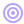
    &nbsp;<b>Focus:</b> <b>clean architecture</b>, <b>maintainable code</b>, and <b>high-performance UI</b>
  </li>

  <li>
    
    &nbsp;<b>Product mindset:</b> <b>turning business needs into clear requirements</b> (flows, edge cases, acceptance criteria)
  </li>

  <li>
    
    &nbsp;<b>Delivery:</b> <b>shipping end-to-end solutions</b>—from idea and design (Figma) to implementation and release
  </li>
</ul>

---

### Daily stack (core skills)

  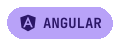
  
  
  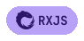
  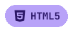
  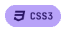
  
  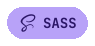

  
  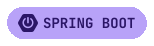
  
  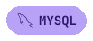

  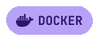
  
  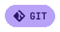
  
  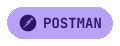
  

---

### Featured projects

  &nbsp;&nbsp;&nbsp;&nbsp;&nbsp;&nbsp;
  

  <a href="https://github.com/aggiovato?tab=repositories" style="text-decoration:none;">
    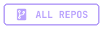
  </a>

---

### Tech stack (full list)

  
<b>Open full stack badges</b>

   

  <table align="center">
  <tr>
  <td align="center" valign="top">
    <i>Languages</i>  
    
    
    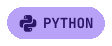 
    
    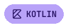 
    
    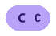
    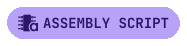
  </td>

  <td align="center" valign="top">
    <i>Frontend</i>  
    
    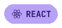
    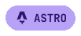 
    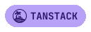
    
     
    
    
    
    
  </td>

  <td align="center" valign="top">
    <i>Backend</i>  
    
    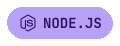
    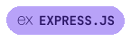 
    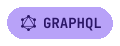
    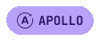
    
  </td>
  </tr>

  <tr>
  <td align="center" valign="top">
    <i>Databases</i>  
    
     
    
    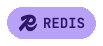
  </td>

  <td align="center" valign="top">
    <i>Tooling / DevOps</i>  
    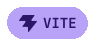
    
     
    
    
    
  </td>

  <td align="center" valign="top">
    <i>Tools</i>  
    
    
  </td>
  </tr>
  </table>

---

### GitHub activity

  
  

  
<b>Top languages</b>

   
  

    
  

---

### Why “aggiovato”?
From **Giove** (*Jupiter* in Italian): a nickname I’ve carried for years—think “landed on Jupiter”.  
It’s rare enough to be instantly recognizable (and finding it taken online is almost impossible :)

---

### Links & resources
<ul>
  <li>
    
    &nbsp;<b>Portfolio:</b> <a href="#">coming soon</a>
  </li>
  <li>
    
    &nbsp;<b>Notes:</b> <a href="#">coming soon</a>
  </li>
  <li>
    
    &nbsp;<b>Coding playlist:</b> <a href="#">coming soon</a>
  </li>
</ul>

---

  Shipping features… one step closer to an “aggiovato” 😉

