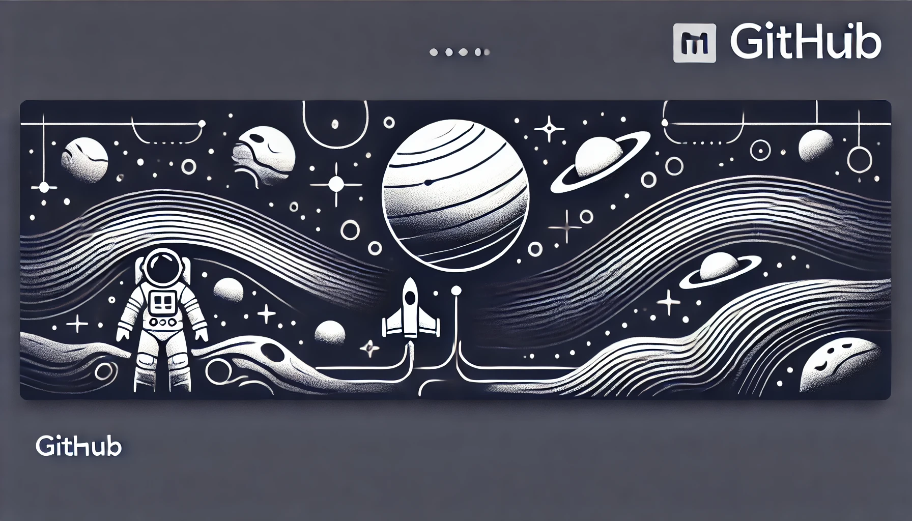

  

<h1 align="center">Alejandro Lugo <i>(aggiovato)</i></h1>

**`Full-Stack Dev`** | **`Telecom & Electronics Engineer`** | **`React Zealot`**

I'm an engineer in **Telecom & Electronics** who fell in love with **programming and web development**. What started as curiosity became a passion, leading me to master both **frontend and backend** development.  
Currently, I'm expanding my skills as a **DAW & DAM student**, while leveraging **over two years of self-taught & freelance experience**. I thrive on solving complex problems and crafting scalable, elegant solutions.

---

## 🛠️ Battle-Ready Stack

<small><i>Programming Languages</i></small> 

  

<small><i>Frontend</i></small> 

  

  

  

  

<small><i>Backend</i></small> 

  
  

<small><i>Data Base</i></small> 

  

<small><i>Package Managers / Bundlers</i></small> 

  

<small><i>DevOps</i></small> 

  

<small><i>Tools & Utilities</i></small> 

  

---

## 📊 GitHub Stats

 

 

---

## 🏆 GitHub Trophies

---

### 💡 From Crying Over Assembly to Smiling with React

My journey started with **low-level programming**, battling with Assembly and complex algorithms.  
 Over time, I found my passion in **web development**, where modern tools like **Astro, React, and Node.js** made coding fun and powerful.  
 Now, I enjoy building sleek, efficient, and high-performance web applications! 🚀

---

### 🧐 Why "aggiovato"?

---

### 🎁 My gifts to You

🔹 **Cool Repos:** [Repo 1](#), [Repo 2](#), [Repo 3](#)  
 🔹 **Music for Coding:** [Playlist 1](#), [Playlist 2](#)  
 🔹 **Dev Resources:** [Free Courses](#), [Best Tools](#)

---
