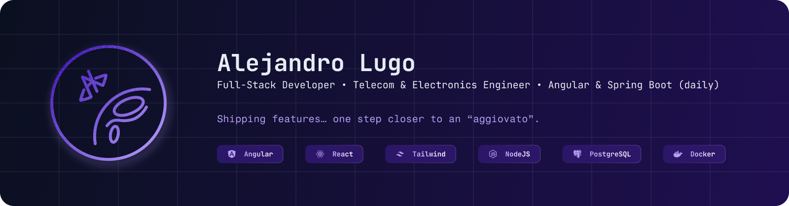

  

  <b>Full-Stack Developer</b> • <b>Telecom & Electronics Engineer</b> • <b>Web & Product-minded</b>

  

  

  
  <!--  -->

---

### About
I’m a **Telecom & Electronics Engineer** who pivoted into **software & web development**—now building products across **frontend and backend**.
My path started with **low-level programming**: strong foundations in **C**, **C++ OOP**, and **microprocessor Assembly**. That technical depth made me fall in love with software engineering—and naturally pushed me into the **web ecosystem**, where I build scalable products with modern frontend and backend stacks.

- 🎯 Focus: **clean architecture, maintainable code, and high-performance UI**
- 🧠 Mindset: strong fundamentals + pragmatic delivery
- 🌍 I enjoy solving real business problems end-to-end

---

### Core skills (daily stack)
#### Frontend
- **Angular (daily)**  
- **React + Astro**
- **JavaScript / TypeScript**
- **HTML • CSS • SCSS • Tailwind**

#### Backend
- **Java (Spring Boot) — daily**
- **Node.js / Express**
- **REST APIs • GraphQL**

#### Databases
- **MongoDB • PostgreSQL • MySQL • Redis**

#### Tooling / DevOps
- **Vite • Docker • Git/GitHub** (and more below)

---

### Featured projects

  
  
  

  

---

### Tech stack (full list)

  
<b>Open full stack badges</b>

   

  <small><i>Programming Languages</i></small> 
  
  
  
  
  
  

    
  <small><i>Frontend</i></small> 
  
  
  
  
  
  
  

    
  <small><i>Backend</i></small> 
  
  
  
  
  

    
  <small><i>Databases</i></small> 
  
  
  
  

    
  <small><i>Tooling / DevOps</i></small> 
  
  
  
  

---

### GitHub activity

  
  

  
<b>Top languages</b>

   
  

    
  

---

### Why “aggiovato”?
From **Giove** (*Jupiter* in Italian): a nickname I’ve carried for years—think “landed on Jupiter”.  
It’s rare enough to be instantly recognizable (and finding it taken online is almost impossible :)

---

### Links & resources
> Committing soon

---

  Shipping features… one step closer to an “aggiovato” 😉

